-   [Bakery Transaction Analysis](#bakery-transaction-analysis)
    -   [Prerequisites](#prerequisites)
    -   [Explore Data](#explore-data)
    -   [Clean Data](#clean-data)
    -   [Exploratory Data Analysis](#exploratory-data-analysis)
    -   [Item Combination](#item-combination)
    -   [Find the best item combinations with coffee](#find-the-best-item-combinations-with-coffee)
    -   [Item Association Rules](#item-association-rules)
    -   [Acknowledgments](#acknowledgments)

Bakery Transaction Analysis
===========================

This dataset contains the transaction records of a bakery shop. We tried to find the best combination of items that generally were bought together.

### Prerequisites

First remove everything in the workspace, and read all libraries needed.

``` r
rm(list=ls())
library(tidyverse)
library(dplyr)
library(reshape2)
library(data.table)   #read large files
library(lubridate)
library(arules)    #association rules
library(arulesViz) #association rules
library(ggplot2)
library(RColorBrewer)  
library(Hmisc)
```

Explore Data
------------

``` r
data = fread("~/Desktop/R/meetup/bakery-transaction-master/BreadBasket_DMS.csv",sep=",",stringsAsFactors=F)
describe(data)
head(data)

# Correct date and time column types
data = data %>% 
  mutate(
    Date = as.Date(Date),  
    Time = as.ITime(Time)  
  )
str(data)

# find how many unique items that we have
data_item <- data %>%
  group_by(Item) %>%
  summarise(Count = n()) 

lengths(data_item)[2]
```

Clean Data
----------

``` r
word_list = c("NaN", "-", "nan", "NAN", "None", "NONE", "none", " ", "_", ".")
found<-c()
 for ( i in c(1:length(word_list))) {
    if (sum(which(data$Item==word_list[i]))>0) {
    found=c(found,i)
    }
 }   

# Found word types is 1 so only one of thing in my list founded in our data ("NONE")    
found_words = word_list[found]

# how many of them are "NONE" 
nrow(data[which(data$Item == "NONE"),])

# Data include 786 missing values so let's drop them
data_clean = data[!(data$Item %in% found_words), ]
data_item1 = data_clean %>%
  group_by(Item) %>%
  summarise(Count = n()) %>%
  data.frame()

lengths(data_item1)[2]

# save cleaned file
fwrite(data_clean,"~/Desktop/R/meetup/bakery-transaction-master/BreadBasket_DMS_clean.csv")
```

Exploratory Data Analysis
-------------------------

We start with time variables.

### How many items were made across the year

``` r
data_clean = data_clean %>%
  mutate(
    Date = as.Date(Date),  
    Time = as.ITime(Time),
    Hour = as.factor(hour(Time)),
    Weekday = weekdays(Date)
  )

data_clean %>% group_by(Date, Item) %>% summarise(Count=n()) %>% 
  mutate(Year = year(Date)) %>%
  ggplot(aes(x=Date, y=Count, colour=factor(Year))) +
  geom_line() +
  theme(legend.position = "bottom") +
  scale_color_manual(values=c("coral", "cornflowerblue")) +
  labs(y="Transactions", title="Total Transactions by Date", colour="Year") 
```

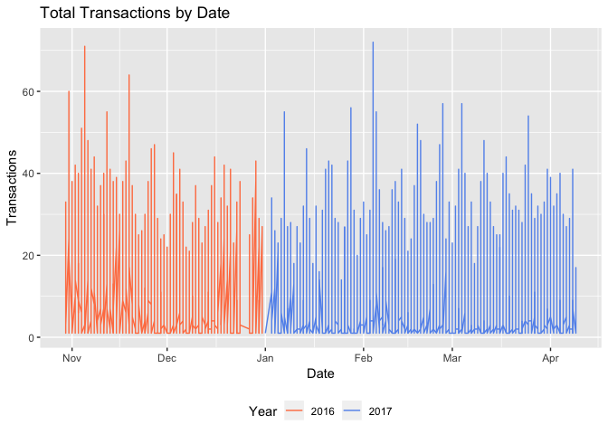

> November and February seem to be the busiest months. We will dig deeper to find out.

### Transcations by Month

``` r
data_clean %>% 
  mutate(Month = as.factor(month(Date))) %>%
  group_by(Month, Transaction) %>% 
  summarise(Count=n()) %>%
  ggplot(aes(x=Month)) +
  geom_histogram(stat="count", fill="cornflowerblue", width=.6) +
  labs(y="Transactions", title="Total Transactions by Month") +
  scale_y_continuous(limits = c(0,3000))
```

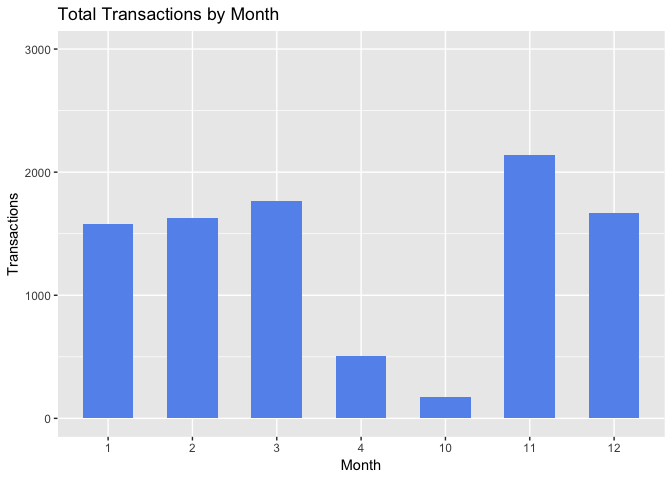

``` r

data_clean %>% 
  mutate(Month = as.factor(month(Date))) %>%
  group_by(Month, Transaction) %>% 
  summarise(Count=n()) %>%
  ggplot(aes(x=Month, y=Count, fill=Month)) +
  geom_boxplot() +
  labs(y="Transactions", title="Total Transactions by Month") +
  scale_fill_brewer(type="seq", palette = "Set3") +
  theme(legend.position = "none") +
  scale_y_continuous(limits = c(0,15)) 
```

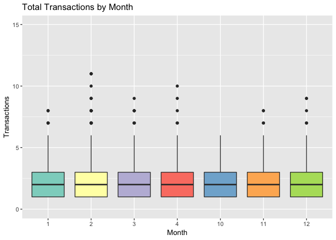

> November is likely to be the busiest month, whereas April and October are the slowest months. However, it may due to that April and October are the beginning and ending period of our data collection process. People bought 2 items each time in average.

### Transcations by Weekday

``` r
data_clean %>% mutate(Weekday = weekdays(Date),
                      Weekday = factor(Weekday, levels=c("Monday", "Tuesday", "Wednesday", "Thursday", "Friday", "Saturday", "Sunday"))) %>%
  group_by(Weekday, Transaction) %>%
  summarise(Count=n()) %>%
  ggplot(aes(x=Weekday, fill=Weekday)) +
  geom_histogram(stat="count") +
  scale_y_continuous(limits=c(0,2500)) +
  labs(y="Transactions", title="Total Transactions by Weekday") +
  scale_fill_brewer(type="seq", palette = "Set3")
```

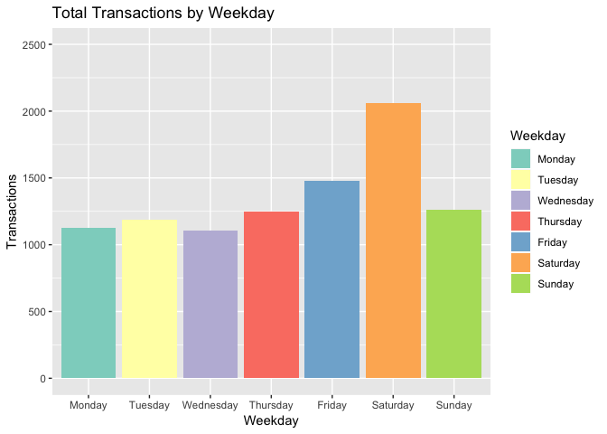

``` r
  
data_clean %>% mutate(Weekday = weekdays(Date),
                      Weekday = factor(Weekday, levels=c("Monday", "Tuesday", "Wednesday", "Thursday", "Friday", "Saturday", "Sunday"))) %>%
  group_by(Weekday, Transaction) %>%
  summarise(Count=n()) %>%
  ggplot(aes(x=Weekday, y=Count, fill=Weekday)) +
  geom_boxplot() +
  labs(y="Items per Transaction", title="Items per Transactions by Weekday") +
  scale_y_continuous(limits=c(0,15)) +
  scale_fill_brewer(type="seq", palette = "Set3")
```

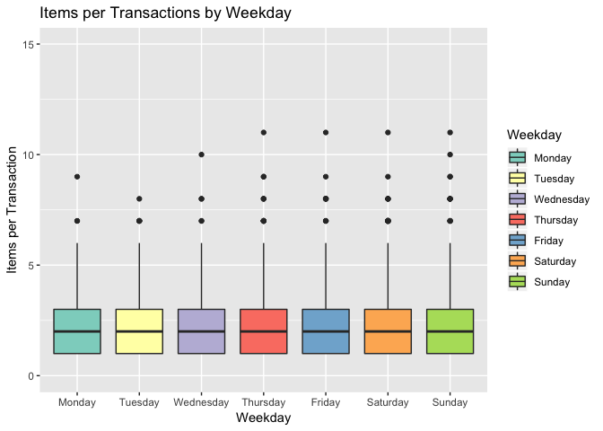

> People love buying breads on Saturday. We can see that people generally bought 2 items each time, which is the same as our previous findings. Monday through Thursday is the quietest period among all week.

### How many transcations were made per hour.

``` r
data_hr = data_clean %>% mutate(Hour = as.factor(hour(Time))) %>% 
  group_by(Hour, Transaction) %>% summarise(Count = n())

# set colour for plots
colourCount = length(unique(data_hr$Hour))
getPalette = colorRampPalette(brewer.pal(12, "Set3"))

### How many transactions were happend in each hour
data_hr %>%
  ggplot(aes(x = Hour, fill = Hour)) +
  geom_histogram(stat="count") +
  theme(legend.position="none") +
  labs(x = "Hour", y = "Transactions", title = "Transactions per hour (Unique Transaction ID)") +
  scale_fill_manual(values = getPalette(colourCount)) 
```

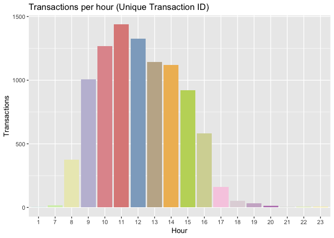

``` r

data_hr %>%
  ggplot(aes(x = Hour, y=Count, fill = Hour)) +
  geom_boxplot() +
  theme(legend.position="none") +
  labs(x = "Hour", y = "Transactions", title = "Transactions per hour (Unique Transaction ID)") +
  scale_fill_manual(values = getPalette(colourCount)) 
```

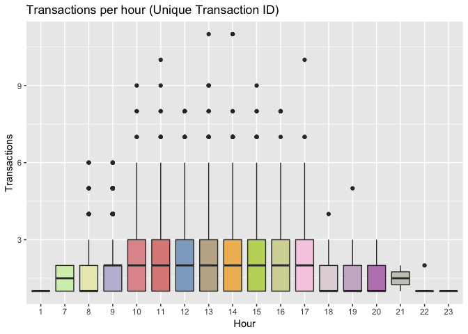

> Between 11am and 2pm are the busiest hour, during which 11am reached the peak of all. On avearge, people bought more items from 10am to 5pm.

### Find most popular items

``` r
colourCount = 20
getPalette = colorRampPalette(brewer.pal(12, "Set3"))

data_clean %>% group_by(Item) %>% summarise(Count=n()) %>%
  arrange(desc(Count)) %>% head(20) %>%
  ggplot(aes(x=reorder(Item, Count), y=Count, fill=Item)) +
  geom_bar(stat="identity") +
  coord_flip() +
  theme(legend.position="none") +
  labs(x="Item", y="Counts", title="Top 20 popular items") +
  scale_fill_manual(values = getPalette(colourCount)) 
```


> Coffee really is our old time favourite!

### Find top 10 items, and sum the rest into "others"

``` r
head(data_item1)
rank_data = arrange(data_item1, desc(Count)) %>% data.frame()
top10 = rank_data[1:10,]
top10[11,"Count"] = sum(rank_data$Count) - sum(top10$Count)
top10[11,"Item"] = "Other"
top10

###bar plot for top 10 items
ggplot(top10, aes(x=reorder(Item, Count), y=Count, fill=Item)) +
  geom_bar(stat="identity") +
  coord_flip() +
  scale_fill_brewer(type="seq", palette = "Set3") +
  theme(legend.position="none") +
  labs(x = "Item", y = "Transaction", title = "Top 10 Transactions") 
```

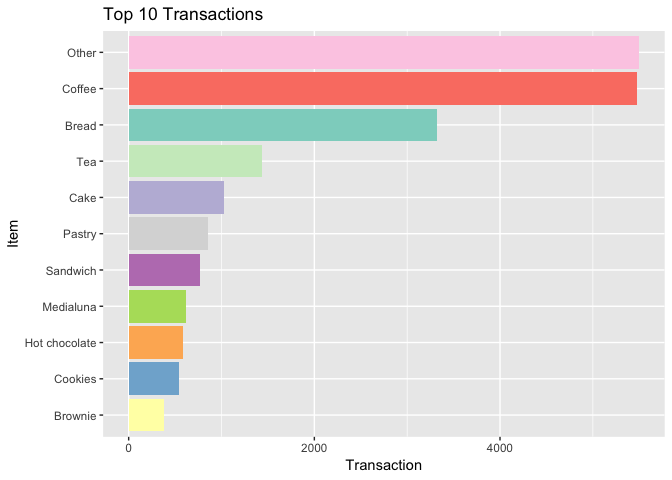

``` r

###create a blank theme
blank_theme <- theme_minimal()+
  theme(
    axis.title.x = element_blank(),
    axis.title.y = element_blank(),
    panel.border = element_blank(),
    panel.grid=element_blank(),
    axis.ticks = element_blank(),
    plot.title=element_text(size=14, face="bold")
  )

###pie chart for top 10 items
top10$Percent = round(top10$Count/sum(top10$Count),4)*100
top10$Item = factor(top10$Item, c("Coffee","Bread","Tea","Cake","Pastry","Sandwich","Medialuna","Hot chocolate","Cookies","Brownie","Other"))
ggplot(top10, aes(x="", y=Count, fill=Item)) +
  blank_theme +
  geom_bar(width = 1, stat = "identity", colour = "white") +
  coord_polar("y", start = 0) +
  scale_fill_brewer(palette = "Set3") +
  geom_text(aes(label = paste0(Percent, "%")),
            position = position_stack(vjust = 0.5), size=4) + 
  labs(fill="Item", title = "Top 10 Transcations") +
  theme(axis.text.x=element_blank(), 
        plot.title = element_text(hjust=.5, size=15),
        legend.text = element_text(size=10))
```

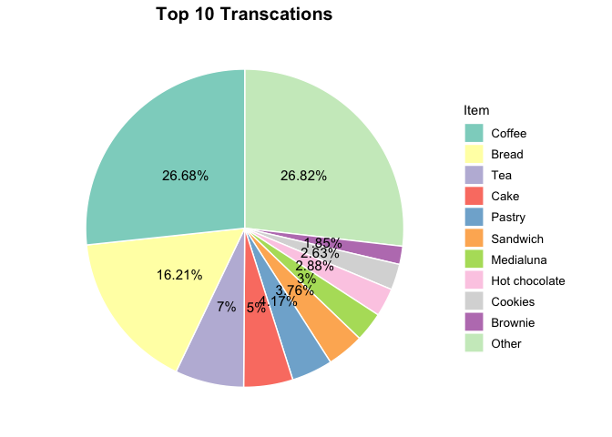

### Use Heatmap to examine When and What people buy

#### Separate 'Coffee' and 'Bread' because they have most majorities

``` r
top10data = data_clean[grep(paste(top10$Item[-11], collapse="$|"), data_clean$Item),]
top10data = summarise(group_by(top10data, Item, Weekday), Count = n())

### Because Bread and Coffee have too many frequencies, so separate them from others
a1 = top10data[grep("Coffee|Bread", top10data$Item),]
ggplot(a1, aes(x=Weekday, y=Item)) +
  geom_tile(aes(fill=Count), colour="white") +
  scale_fill_continuous(low="white", high="steelblue", name="Count") +
  labs(title = "Purchase Frequency by Weekday\nWith Coffee & Bread") 
```

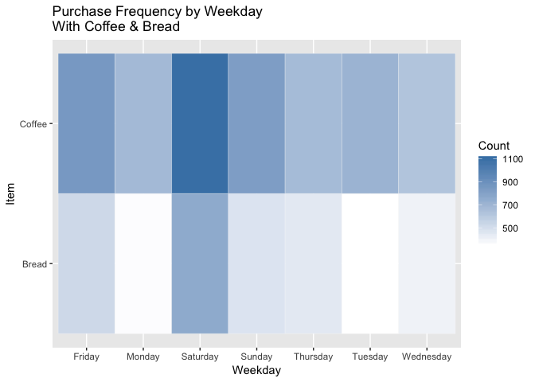

``` r
  
a2 = top10data[grep("Coffee|Bread", top10data$Item, invert=TRUE),]
ggplot(a2, aes(x=Weekday, y=Item)) +
  geom_tile(aes(fill=Count), colour="white") +
  scale_fill_continuous(low="white", high="steelblue", name="Count") +
  labs(title = "Top 10 Items Purchase Frequency by Weekday\nWithout Coffee & Bread")
```

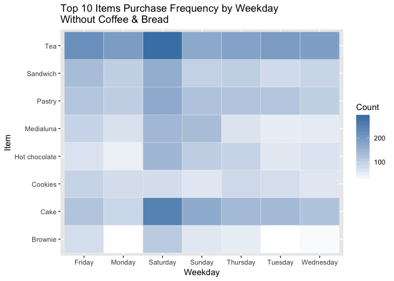

``` r

### Heat map between Hour and Top 10 items
top10datahr = data_clean[grep(paste(top10$Item[-11], collapse="$|"), data_clean$Item),]
top10datahr = summarise(group_by(top10datahr, Item, Hour), Count = n())

b1 = top10datahr[grep("Coffee|Bread", top10datahr$Item, invert=FALSE),] 
ggplot(b1, aes(x=Hour, y=Item)) +
  geom_tile(aes(fill=Count), colour="white") +
  scale_fill_continuous(low="white", high="steelblue", name="Count") +
  labs(title = "Top 10 Items Purchase Frequency by Hour\nWith Coffee & Bread")
```

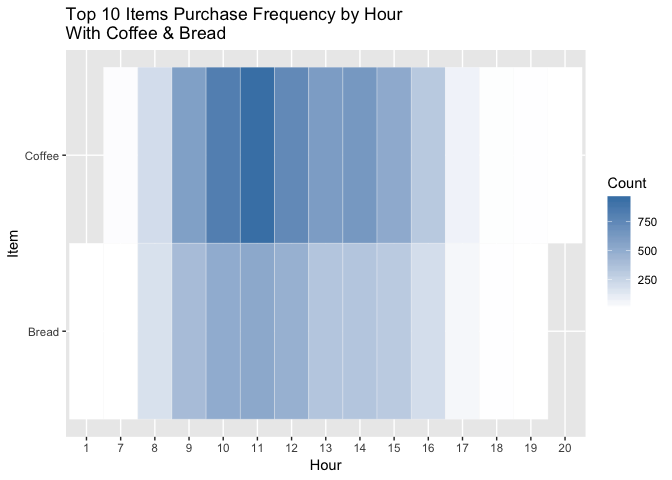

``` r

b2 = top10datahr[grep("Coffee|Bread", top10datahr$Item, invert=TRUE),] 
ggplot(b2, aes(x=Hour, y=Item)) +
  geom_tile(aes(fill=Count), colour="white") +
  scale_fill_continuous(low="white", high="steelblue", name="Count") +
  labs(title = "Top 10 Items Purchase Frequency by Hour\nWithout Coffee & Bread")
```

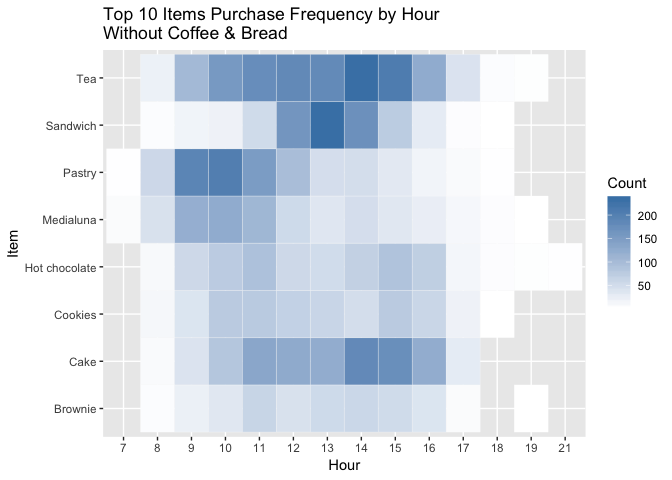

> *By Weekday - Has not much to see. The trend is similar to pervious plots where Saturday has the most transactions. *By Hour - We can see that Coffee is really popular especially before lunch time (11am) whereas Sandwiches are most popular after lunch time (1pm). People love haveing cake between 2-3 pm, perhaps it's a suitable tea time for everyone.

### Summary of Exploratory Analysis

-   November is the busiest month, whereas April and October are the slowest months. It may beacuse of April and October are the beginning and ending period of our data collection process. People bought 2 items each time on a monthly average.
-   Normal weekday is quieter than weekends. People generally bought 2 items each time on a weekly basis.
-   This bakery is open from 7am until 1am. The busiest hours are between 10am and 4pm. People generally bought more items from 10am and 5pm.
-   Among this period, 11am has the highest transactions. This may implies that people bought bread for lunch and hence the hightest transcations.
-   Most popular items are coffee, tea, bread, cake and pastry.

Item Combination
----------------

### Find which transactions purchased more than two items

``` r
data.more = data_clean %>% 
  group_by(Transaction) %>%
  mutate(ItemsPurchased = n(),
         Combined = ifelse(ItemsPurchased>1, TRUE, FALSE)) 
temp = data.more %>%
  filter(Combined=="TRUE") %>%
  group_by(Item, ItemsPurchased) %>%
  summarise(TransactionMoments = n()) %>%
  filter(TransactionMoments>100 & ItemsPurchased>1)  #select only the most popular ones 

colourCount = temp$Item %>% unique() %>% length()
temp %>%    
  ggplot(aes(x=Item, y=TransactionMoments, fill=Item)) +
  geom_bar(stat="identity") +
  facet_grid(ItemsPurchased~.) +
  theme(axis.text.x = element_text(angle=90, hjust=1, vjust=.5),
        legend.position = "none") +
  labs(title="Popular Item Purchased Combination") +
  scale_fill_manual(values = getPalette(colourCount)) 
```


> -   The above graph shows the transaction moments that are more than 100 times.
> -   We can see that customer who has 6 items in their basket usually contains coffee, indicating coffee is a great combination with other items.
> -   Tea, Bread and Cake are also usually bought with other items, with less than 5 items at one time.

### Similary, we find which items were bought independently

``` r
combined.items = data.more %>% 
  group_by(Item, ItemsPurchased) %>%
  summarise(TransactionMoments = n()) %>%
  filter(TransactionMoments>100 & ItemsPurchased>1)
temp = data.more %>% filter(Combined=="FALSE") %>%
  group_by(Item) %>% summarise(TransactionMoments = n())
temp1 = temp[!(temp$Item %in% unique(combined.items$Item)),] 
colourCount = temp1$Item %>% unique() %>% length()
temp1 %>%
  ggplot(aes(x=reorder(Item, -TransactionMoments), y=TransactionMoments, fill=Item)) +
  geom_bar(stat="identity") +
  theme(axis.text.x = element_text(angle=90, hjust=1, vjust=.5),
        legend.position = "none") +
  labs(x="Item", title="Items Bought Independently") +
  scale_fill_manual(values = getPalette(colourCount))
```


> People usually bought item "Farm House" alone.

Find the best item combinations with coffee
-------------------------------------------

``` r
coffee_data = data[which(data$Item=="Coffee"),]   
ncoffee_data = data[which(data$Item!="Coffee"),]

coffee_transac_list = coffee_data$Transaction
ncoffee_data[ncoffee_data$Transaction %in% coffee_transac_list == TRUE,"Coffee"] = "with"
ncoffee_data[ncoffee_data$Transaction %in% coffee_transac_list == FALSE,"Coffee"] = "without"
buywithcoffee = ncoffee_data %>%
  group_by(Item, Coffee) %>%
  summarise(Count = n())
head(buywithcoffee)

### only check whether top 10 items were bought along with coffee
top10buy = buywithcoffee[buywithcoffee$Item %in% top10$Item == TRUE,] %>% data.frame()
top10buy$Coffee = factor(top10buy$Coffee, levels = c("without", "with"))
top10buy1 = dcast(top10buy, Item~Coffee, value.var = c("Count"))
top10buy1$compare = round(top10buy1$with/top10buy1$without,2)

top10buy2 = top10buy %>% group_by(Item) %>% #top10buy2 is for text use 
 summarise(Sum=sum(Count)) %>% arrange(desc(Sum))
top10buy2$compare = NULL
for(i in 1:nrow(top10buy2)){
  for(j in 1:nrow(top10buy1)){
    if (top10buy2$Item[i] == top10buy1$Item[j]) top10buy2$compare[i] = top10buy1$compare[j]
  }
}

ggplot(top10buy, aes(x=reorder(Item, -Count), y=Count, fill=Coffee)) +
  geom_bar(stat = "identity", position = "stack") +
  scale_fill_manual(labels=c("with" = "With coffee", "without" = "Without coffee"),
                    values=c("with"="lightskyblue2", "without" = "cornflowerblue")) +
  coord_flip() +
  labs(x="Item", y="Count", fill="", title="Sales Information of Top 10 Items With/Without Coffee") +
  theme(legend.position = "bottom") +
  geom_text(aes(label = paste0(Count)),
            position = position_stack(vjust = 0.5), size=3, colour="white") +
  scale_x_discrete(labels = paste0(top10buy2$Item," ", top10buy2$compare, "%")) +
  guides(fill = guide_legend(reverse = TRUE))
```


> The chance of consumers bought bread with coffee is 0.38% lower than those who bought bread without coffee. That is to say, bread and coffee is really not a good combination.

### Summary of item combination

-   Coffee and bread is the worst combination in top 10 purchased items, following by tea and bread.
-   The most popular combination in top 10 purchased items was Medialuna and coffee. Bakeries may start working on it!

Item Association Rules
----------------------

``` r
transaction.data <- read.transactions("~/Desktop/R/meetup/bakery-transaction-master/BreadBasket_DMS_Clean.csv",
  format = "single", # single is used because each column has 1 item
  cols = c(3,4), # specifies the item and transaction columns
  sep = ",")

itemFrequencyPlot(transaction.data,
  topN=4, # Show top 4 items
  type="absolute", # absolute frequency instead of relative
  main="Most popular items sold (absolute frequency)")
```


``` r

association.rules = apriori(transaction.data,
                            appearance = list(default="lhs",rhs="Coffee"),
                            parameter = list(supp = 0.005, # Minimum support level, frequency of items
                                             conf = 0.6 # Minimum confidence level
                            )
)
#> Apriori
#> 
#> Parameter specification:
#>  confidence minval smax arem  aval originalSupport maxtime support minlen
#>         0.6    0.1    1 none FALSE            TRUE       5   0.005      1
#>  maxlen target   ext
#>      10  rules FALSE
#> 
#> Algorithmic control:
#>  filter tree heap memopt load sort verbose
#>     0.1 TRUE TRUE  FALSE TRUE    2    TRUE
#> 
#> Absolute minimum support count: 32 
#> 
#> set item appearances ...[1 item(s)] done [0.00s].
#> set transactions ...[103 item(s), 6577 transaction(s)] done [0.00s].
#> sorting and recoding items ... [37 item(s)] done [0.00s].
#> creating transaction tree ... done [0.00s].
#> checking subsets of size 1 2 3 4 done [0.00s].
#> writing ... [5 rule(s)] done [0.00s].
#> creating S4 object  ... done [0.00s].

association.rules = sort(association.rules, by = 'support', decreasing = TRUE)
summary(association.rules)
#> set of 5 rules
#> 
#> rule length distribution (lhs + rhs):sizes
#> 2 3 
#> 3 2 
#> 
#>    Min. 1st Qu.  Median    Mean 3rd Qu.    Max. 
#>     2.0     2.0     2.0     2.4     3.0     3.0 
#> 
#> summary of quality measures:
#>     support           confidence          lift           count    
#>  Min.   :0.005626   Min.   :0.6118   Min.   :1.262   Min.   : 37  
#>  1st Qu.:0.006538   1st Qu.:0.6324   1st Qu.:1.305   1st Qu.: 43  
#>  Median :0.007906   Median :0.6327   Median :1.305   Median : 52  
#>  Mean   :0.012012   Mean   :0.6723   Mean   :1.387   Mean   : 79  
#>  3rd Qu.:0.014140   3rd Qu.:0.7296   3rd Qu.:1.505   3rd Qu.: 93  
#>  Max.   :0.025848   Max.   :0.7551   Max.   :1.558   Max.   :170  
#> 
#> mining info:
#>              data ntransactions support confidence
#>  transaction.data          6577   0.005        0.6
```

### We arrive at 6 rules, shown as below:

``` r
inspect(head(association.rules))
#>     lhs                     rhs      support     confidence lift     count
#> [1] {Toast}              => {Coffee} 0.025847651 0.7296137  1.505229 170  
#> [2] {Spanish Brunch}     => {Coffee} 0.014140185 0.6326531  1.305194  93  
#> [3] {Salad}              => {Coffee} 0.007906340 0.6117647  1.262101  52  
#> [4] {Cake,Hot chocolate} => {Coffee} 0.006537935 0.6323529  1.304575  43  
#> [5] {Cake,Sandwich}      => {Coffee} 0.005625665 0.7551020  1.557812  37
```

> -   lift: the confidence value of the rules (confidence/expected confidence)
> -   if lift &gt; 1, has positive effects on the rules
> -   People who bought Toast and Coffee together represent 2.5% of the transactions.
> -   We have 72.9% certainty that if a person buys toast, he/she will also buy a coffee.

``` r
plot(association.rules)
```


``` r
plot(association.rules, method="graph")
```


> The red colour is based on lift, the redder the greater the lift value (more significant)

Acknowledgments
---------------

Special thanks to two Kaggle kernal, which helps me a lot on this project:

[Bakery Transactions - EDA and Association Rules](https://www.kaggle.com/danilodiogo/bakery-transactions-eda-and-association-rules/notebook?fbclid=IwAR30SBSyF9PXnQlihL-YiyhkIW_8TI4SpVbGi54Eg8YvzRwqhOLci1pxuDc)

[Analysis of Bakery Transactions](https://www.kaggle.com/behcetsenturk/analysis-of-bakery-transactions?fbclid=IwAR2RY_jVetNwxDXk_is1fMyzeL9FFF4yrB59AWIr6YBUxFwXIXgnDZAsVs4)
